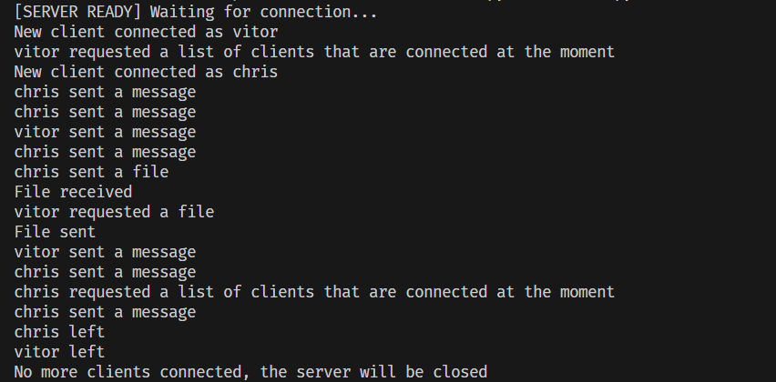
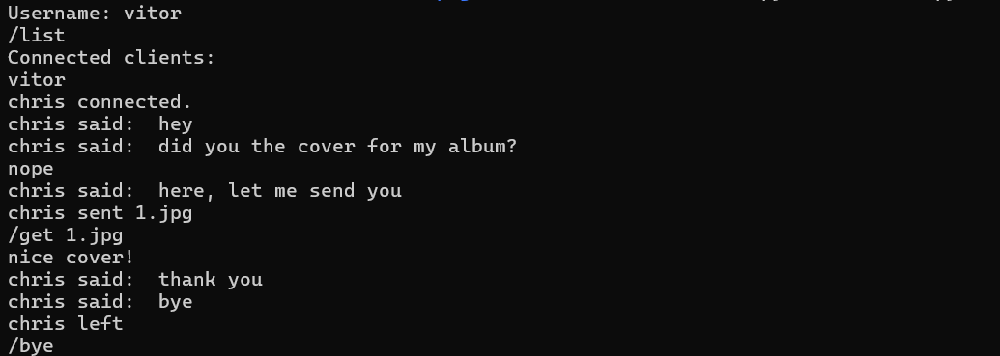

# Network File Chat

This project is a simple client-server application that enables real-time messaging and file exchange between multiple clients over a network. It was developed using Python sockets, utilizing **UDP for messaging** and **TCP for file transfers**.

## Features
- Clients can send messages to each other through the server.
- Users can request a list of currently connected clients.
- File transfer is supported via TCP.
- The server broadcasts notifications about user connections and file uploads.
- Clients can disconnect from the server.

## How It Works

- The **server** listens on port `20000` for both UDP (messages) and TCP (file transfers).
- A **client** first registers with the server using a username.
- Clients can send messages to others, request file transfers, and disconnect from the session.

### Commands
| Command            | Description |
|--------------------|-------------|
| `/list`           | Request a list of connected clients. |
| `/file <filename>` | Send a file to the server. |
| `/get <filename>`  | Retrieve a file from the server. |
| `/bye`            | Disconnect from the server. |

## How to Run

### Running the Server
Open a terminal and run:
```
python server.py
```
The server will start and wait for client connections.

### Running a Client
1. Open a terminal and run:
```
python client.py
```
2. Enter a username when prompted.
3. Use the available commands to interact with the server and other clients.

### Example

- Server side:


- Clients side:



### Requirements
- Python 3.x
- Basic knowledge of networking concepts
